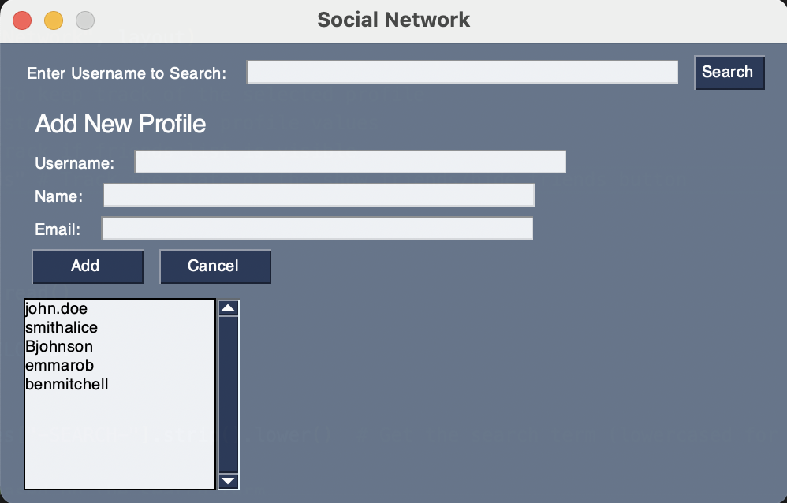
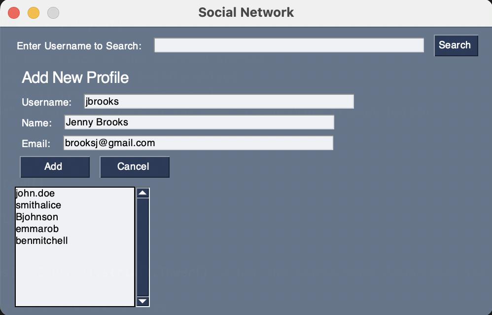
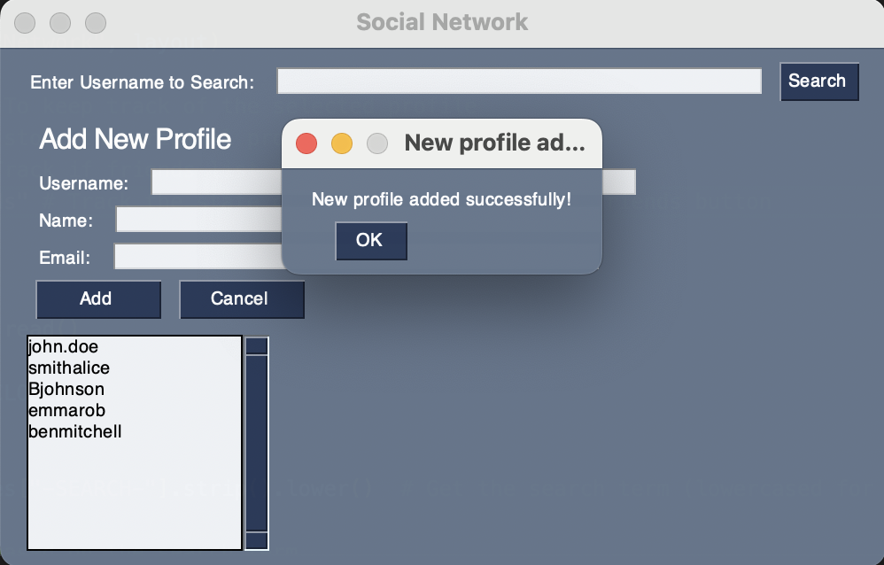
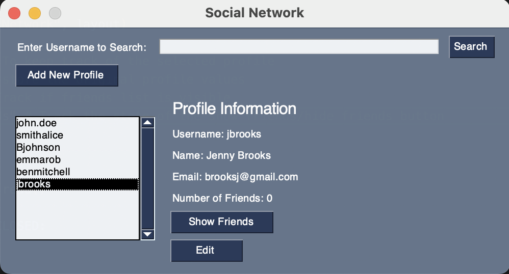

# SocialNetwork
Social Network GUI in Python where you can view profiles and add connections

## Adding New Profiles
Ability to add new profiles within the GUI once pressing the "Add New Profile" button
New text boxes show up to be filled in with user information that will be added as a profile to the network 

 
Popup tells you a profile has successfully been added (all fields are required to be filled out) 

 

## Editing Profiles

## Adding Connections

## Searching for Profiles
