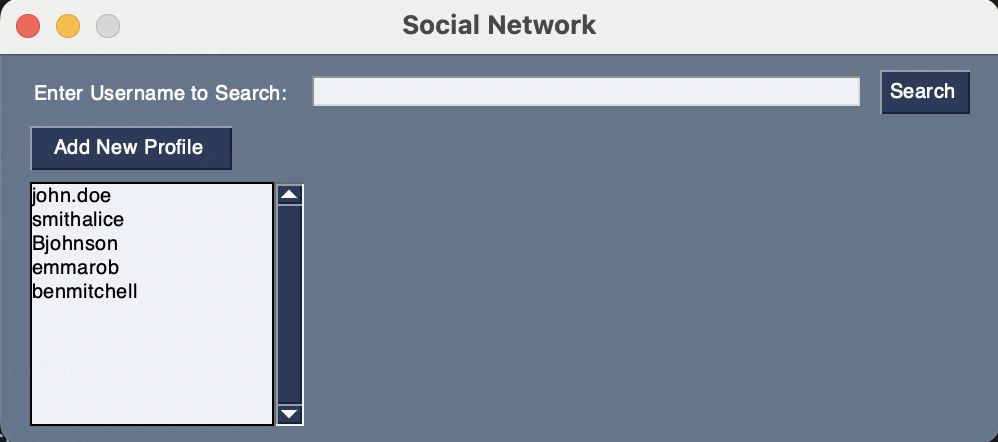
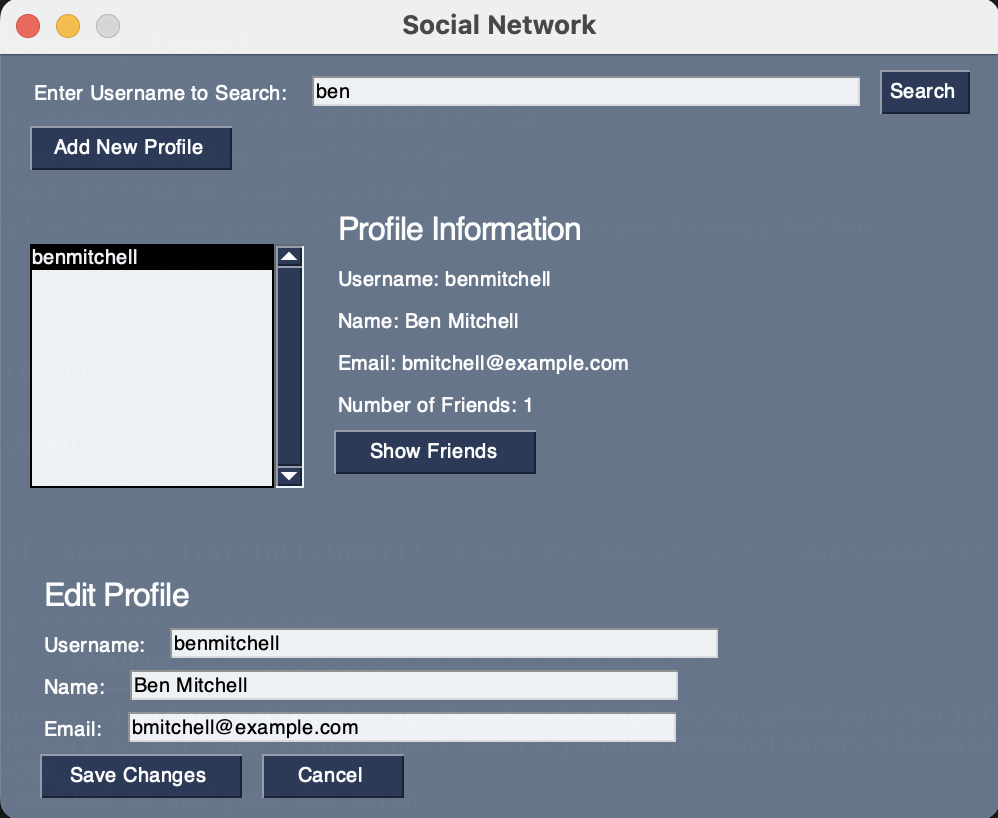
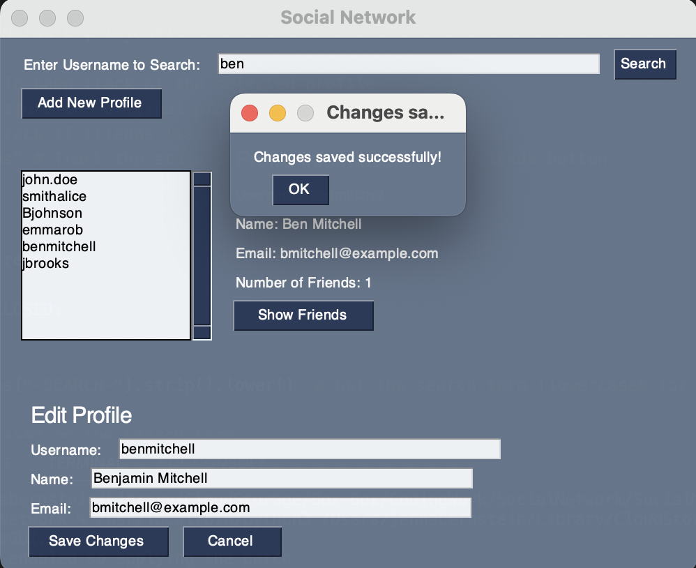
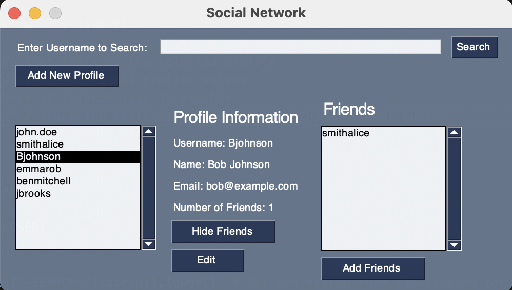
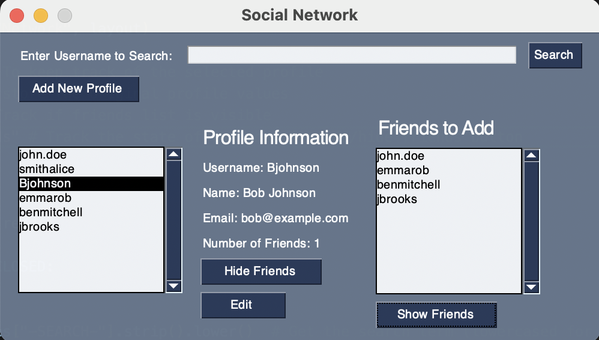
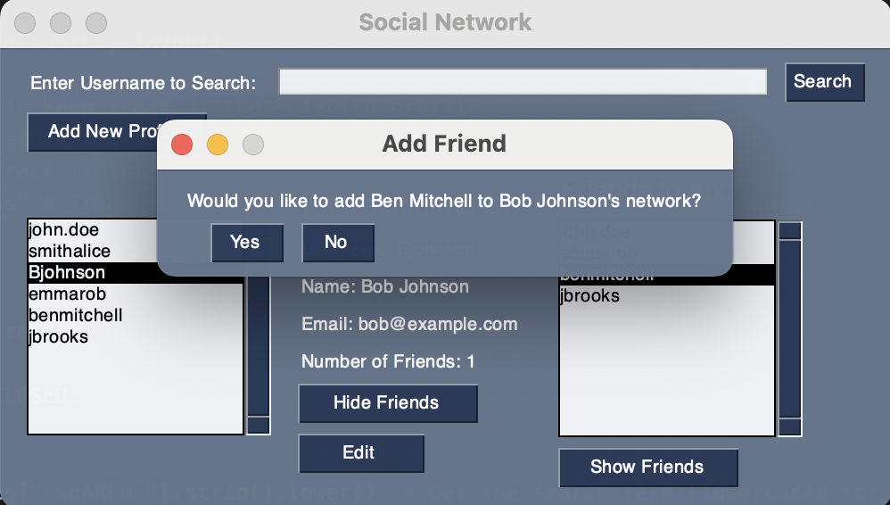
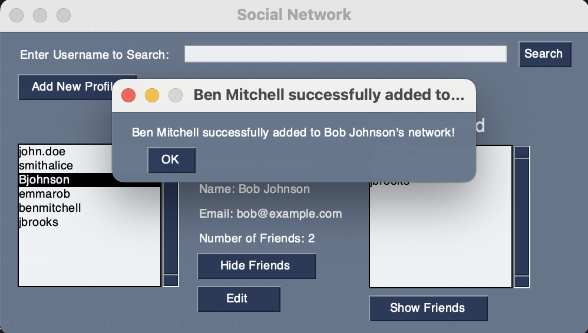
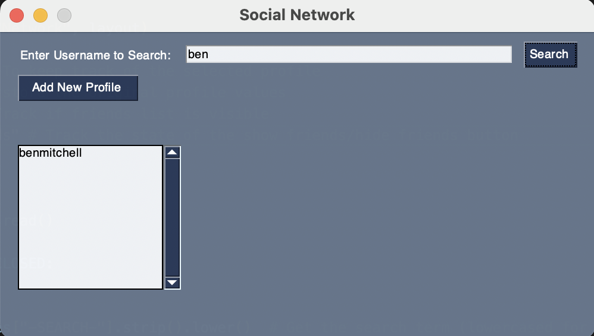
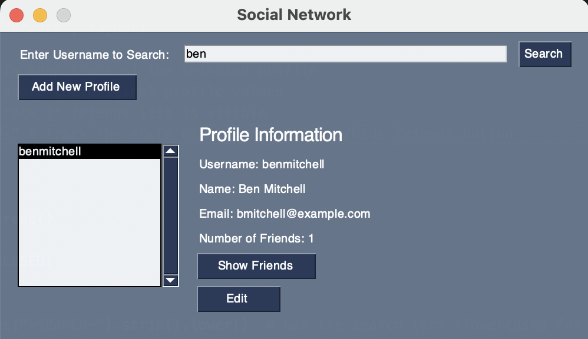

# SocialNetwork
Social Network GUI in Python where you can add and view profiles and add connections from an administrator view. 

## Adding New Profiles
Ability to add new profiles within the GUI once pressing the "Add New Profile" button
New text boxes show up to be filled in with user information that will be added as a profile to the network. 

 
 
Popup tells you a profile has successfully been added (all fields are required to be filled out). 

 

## Editing Profiles
Ability to edit profiles within text editor boxes to update profile information. Notifies the user when new changes have been saved through a popup. 

## Adding Connections
Ability to add two-way connections between users and view the list of connections or add new connections from a list to the side of the profile information. Once clicking "Show Friends", you will see a list of their friends, then if you click "Add Friends", it will show all possible profiles that you could add as friends. Clicking on one of these profiles will ask for confirmation in adding this person to their network.  

## Searching for Profiles
Ability to search for profiles by username from the search bar at the top and view their profile by clicking on the username.  

